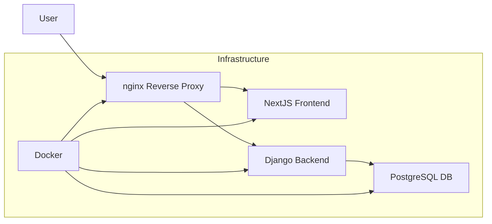
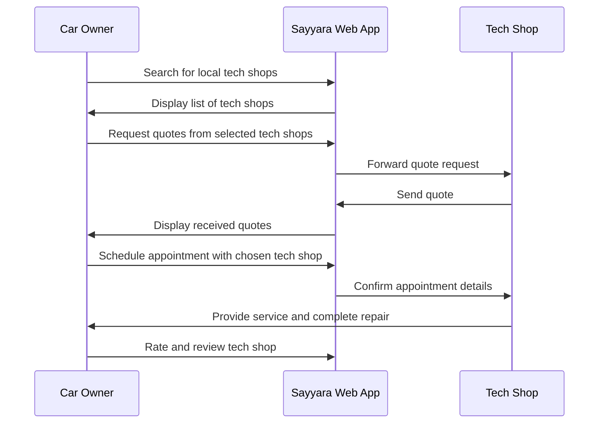

# Sayyara Source Code

The folders and files for this project are as follows:

frontend: contains the frontend code for NextJS webapp
backend: contains the backend code for the Django REST API


To build the docker project ensure that [docker](https://www.docker.com/) is installed.

```
% docker --version
Docker version 20.10.17, build 100c701
```

Run docker compose up to build and start the project containers

```
docker compose up -d --build
```

To rebuild the docker images locally, run the following command

```
docker compose build
```

Use the following command to stop the containers

```
docker compose down
```

To get the logs when running in detached mode, run the following.
```
docker compose logs
```

You can also append service names to the above command to get logs from a specific app like so
```
docker compose logs frontend
```

The frontend is hosted at https://localhost/ and backend admin panel is accessed at http://localhost/api/admin/

The swagger api viewer is hosted at http://localhost/api/swagger

Note: If you're running M1 mac, you'll need to rebuild the docker images.

PS: Make sure you're running these commands from `src/`

We can also alias the localhost to `local.sayyara.io`

Edit `/etc/hosts` and add `127.0.0.1 local.sayyara.io` as an entry.

## Stack Diagram



## Process Diagram

